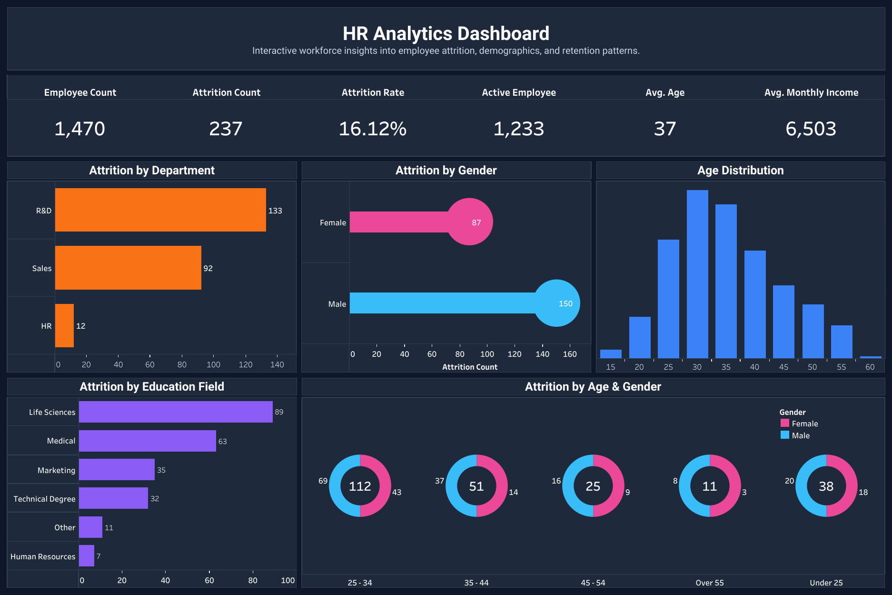

# HR Analytics Dashboard

## Overview

This project presents an interactive Tableau dashboard designed to analyze employee attrition and workforce trends. The dashboard focuses on key HR metrics, enabling users to explore attrition patterns across departments, age groups, education levels, job roles, and other workforce attributes.

The objective of this project is to demonstrate how data visualization can support HR teams in identifying trends, monitoring workforce metrics, and making informed decisions.

---

## Dashboard Features

- Interactive KPI cards
- Employee attrition analysis
- Department-wise insights
- Gender and age group analysis
- Education-wise attrition
- Job role analysis
- Dynamic filters
- Dashboard actions
- Customized tooltips

---

## Tools & Technologies

- Tableau
- Data Visualization
- Dashboard Design
- KPI Reporting

---

## Dashboard Preview

---

## Tableau Public
## Interactive Dashboard

[View Interactive Dashboard on Tableau Public](https://public.tableau.com/views/HRAnalyticsDashboard_17829972577970/HRAnalyticsDashboard?:language=en-US&:sid=&:redirect=auth&:display_count=n&:origin=viz_share_link)

